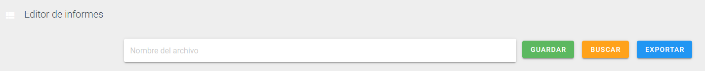
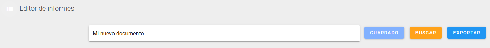
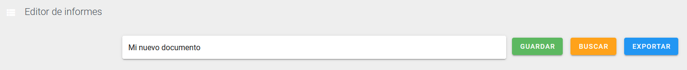

# Editor de informes
> QMS APP incluye un editor de texto enriquecido con más de 15 características para crear todo tipo de documentos (por ejemplo, informes de auditoría). Documentos que luego se pueden
exportar a Word y analizar en busca de no conformidades.
### Ingresar al editor de informes
___
Selecciona la opción *Editor* dentro de la sección de *Informes* en el sidebar como muestra la figura.

### Crear nuevo documento
___
Para crear un nuevo documento, ingresa un nombre en el campo *Nombre del archivo* y presiona el botón *Guardar*.  

Si se logró guardar en la base de datos el botón cambiará su color a azul y su texto a *Guardado*.

### Guardar documento
___
Presiona el botón *Guardar*

