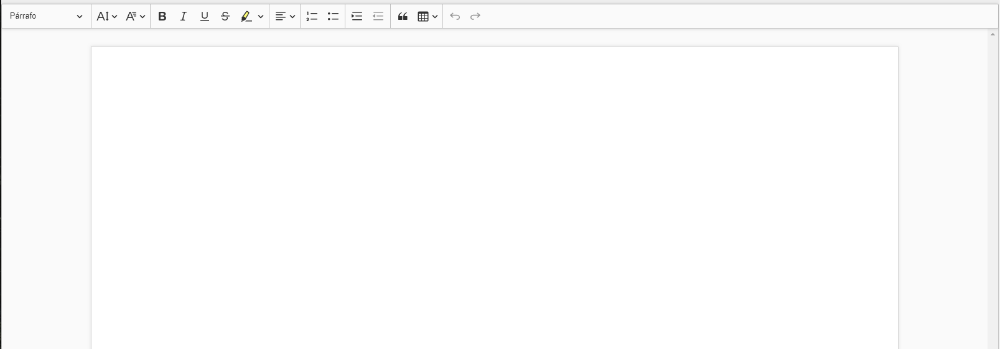

# Editor de informes
> QMS APP incluye un editor de texto enriquecido con más de 15 características para crear todo tipo de documentos (por ejemplo, informes de auditoría). Documentos que luego se pueden
exportar a Word y analizar en busca de no conformidades.
### Ingresar al editor de informes
___
Selecciona la opción *Editor* dentro de la sección de *Informes* en el sidebar como muestra la figura.

### Crear nuevo documento
___
Para crear un nuevo documento, ingresa un nombre en el campo *Nombre del archivo* y presiona el botón *Guardar*.  

Si se logró guardar en la base de datos el botón cambiará su color a azul y su texto a *Guardado*.

### Guardar documento
___
Presiona el botón *Guardar*, cambiará de color para indicar que se guardó correctamente.

### Editar documentos
___
   
Una vez que el documento haya sido creado, puedes empezar a trabajar en el, el editor de QMS APP incluye las siguientes características:
* *Encabezado*: Permite definir si un texto es un párrafo, encabezado 1, 2 o 3. Esta función es útil para crear títulos y subtítulos.
* *Tamaño de fuente*: Cambia el tamaño de la letra del texto seleccionado a las siguientes opciones: minúsculo, pequeño, por defecto, grande y enorme.
* *Fuente*: Cambia el tipo de letra al texto seleccionado, se cuentan con las opciones de: por defecto, Arial, Courier New, Georgia, Lucida Sans Unicode, Tahoma, Times New Roman, Trebuchet MS y Verdana  
* *Negrita*: Pone en negrita el texto seleccionado.
* *Cursiva*: Pone en cursiva el texto seleccionado.
* *Subrayado*: Subraya el texto seleccionado.
* *Tachado*: Tacha el texto seleccionado.
* *Resaltar*: Resalta el texto seleccionado con el color que elijas.
* *Alineamiento del texto*: Permite alinear el texto seleccionado a la izquierda, centro o derecha.
* *Lista numerada*: Crea listas númericas ordenadas ascendentemente.
* *Lista de puntos*: Crea listas con viñetas.
* *Aumentar y disminuir sangría*: Aumenta o quita espacios al texto.
* *Entrecomillado*: Permite crear citas.
* *Tablas*: Permite crear tablas.

### Importar documentos hechos en Word
___
Si tienes documentos ya creados en Word puedes utilizarlos en QMS APP, simplemente copia todo el documento en Word y pegalo en el editor de texto. Es normal que hayan diferencias pequeñas de formato, puedes ajustarlas con las funciones descritas arriba.
### Exportar a Word
___
En el caso de que necesites imprimir el documento o utilizar funciones no incluidas en el editor de texto, puedes exportar un documentro creado en QMS APP a formato Word. Para hacer esto presiona el botón *Exportar*

