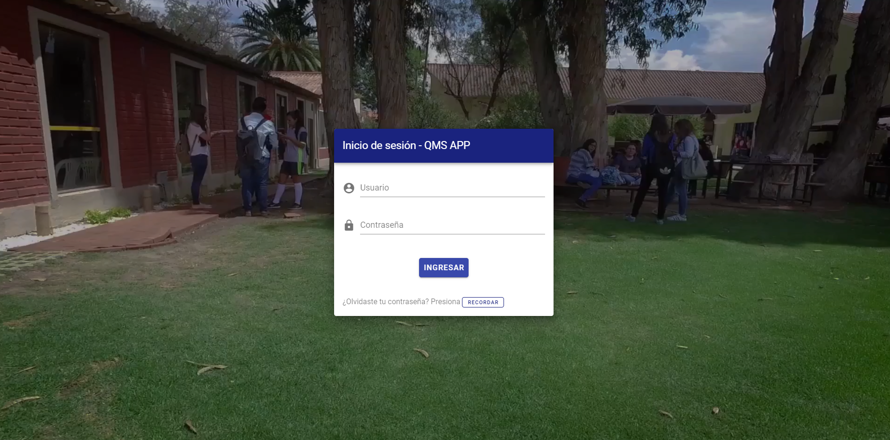

# Iniciar sesión
> Para comenzar a utilizar la aplicación es necesario que inicies sesión con tu nombre de usuario o correo y tu contraseña. 

### Ingresar datos
Una vez que te encuentres en la dirección: http://ec2-18-228-155-128.sa-east-1.compute.amazonaws.com:3000/ podrás observar el siguiente formulario:

En el cual deberás llenar correctamente tus datos:
- Usuario: en este campo se puede colocar el correo electrónico o el usuario.
- Contraseña: debe ser la que corresponde al usuario.

?> La dirección de correo electrónico y usuario proporcionados por el administrador y la contraseña obtenida mendiante el mensaje enviado a su correo.

En caso de haber ingresado incorrectamente los datos el formulario mostrará el siguiente mensaje:

!> Mensaje de error

### Recuperar contraseña

En caso de no recordar la contraseña correspondiente a un usuario debe acceder a la opción *RECORDAR*. Al presionar esta se le redirigirá al siguiente formulario

Donde una vez completado correctamente su correo y aceptado la opción enviar se le enviará un mensaje a su correo con un código de verificación que le permitirá iniciar sesión y reestablecer su contraseña.
