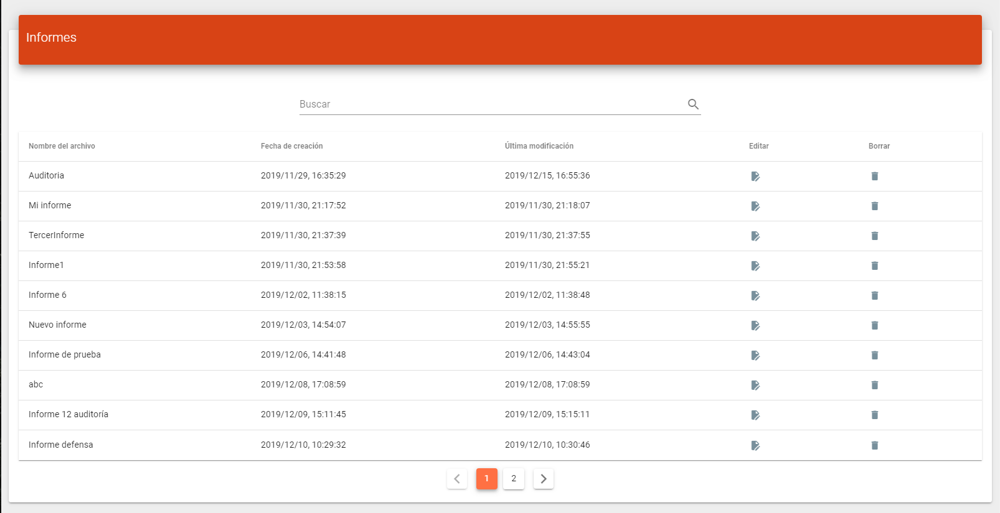
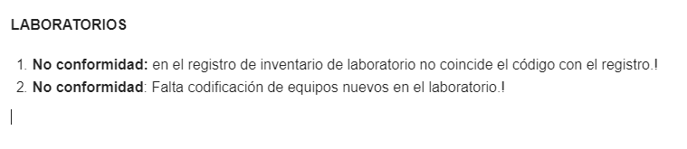
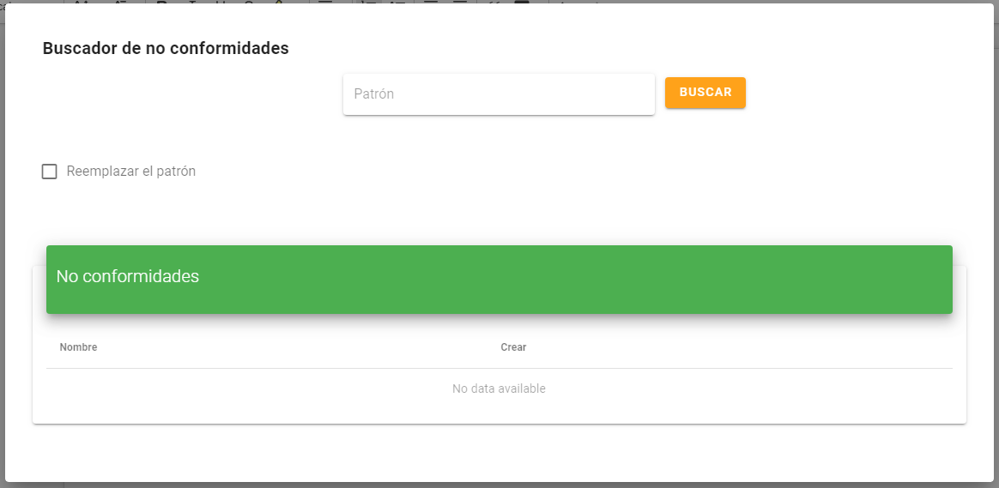
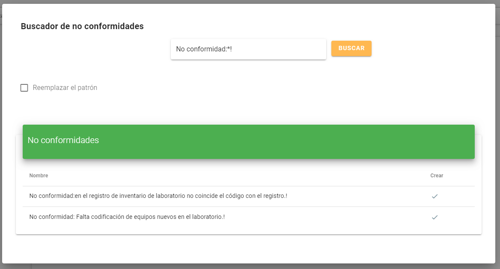

# Extraer no conformidades
> A partir de un informe, puedes extraer no conformidades, observaciones y recomendaciones del texto, mediante el motor de búsqueda de QMS APP. 
### Ingresa al editor de informes con el documento
___
El primer paso es cargar un informe, puedes hacer esto mediante el gestor de informes. Presiona el botón *Editar* del informe correspondiente.

### Extraer desde el documento
___
Supongamos que se quieren extraer las siguientes no conformidades del informe. 

Se debe definir con qué texto empiezan y con qué texto terminan, en este ejemplo las no conformidades que queremos extraer empiezan con el texto *No conformidad:* y terminan con el texto *!*, el motor de búsqueda permite empezar y terminar con cualquier tipo de texto, aquí se definió como texto con el que termina el símbolo *!* pero podría ser cualquier otro.
### Presionar el botón Buscar
___
Presiona *Buscar* para abrir la herramienta de extracción de texto.

### Patrón de búsqueda
___
Ingresa el patrón de búsqueda en el campo *Patrón*, como se mencionó antes, queremos buscar no conformidades que empiecen con *No conformidad:* y que terminen con *!*, para ingresarlo como un patrón hay que seguir la siguiente sintaxis:   
    
*[Texto con el que empieza] * [Texto con el que termina]*
   
Que para este ejemplo sería:
**No conformidad:*!**
   
Donde el asterisco (*) representa cualquier letra o número que se encuentre entre el texto inicial y final.

  
   
Una vez ingresado el patrón presiona el botón Buscar, aparecerá una lista con los fragmentos del texto que se encontraron.   
  

   
Ahora puedes presionar el botón *Crear* de la no conformidad correspondiente para generar un nuevo plan de acción.